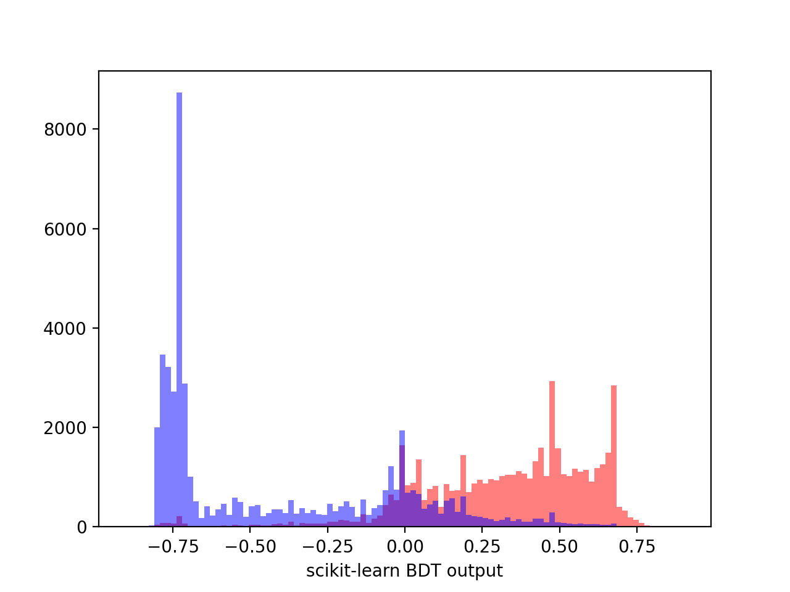
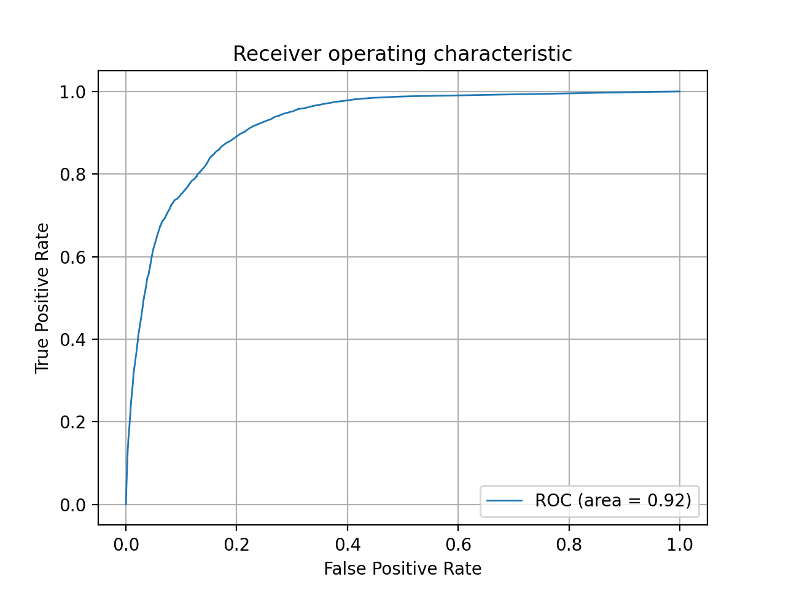
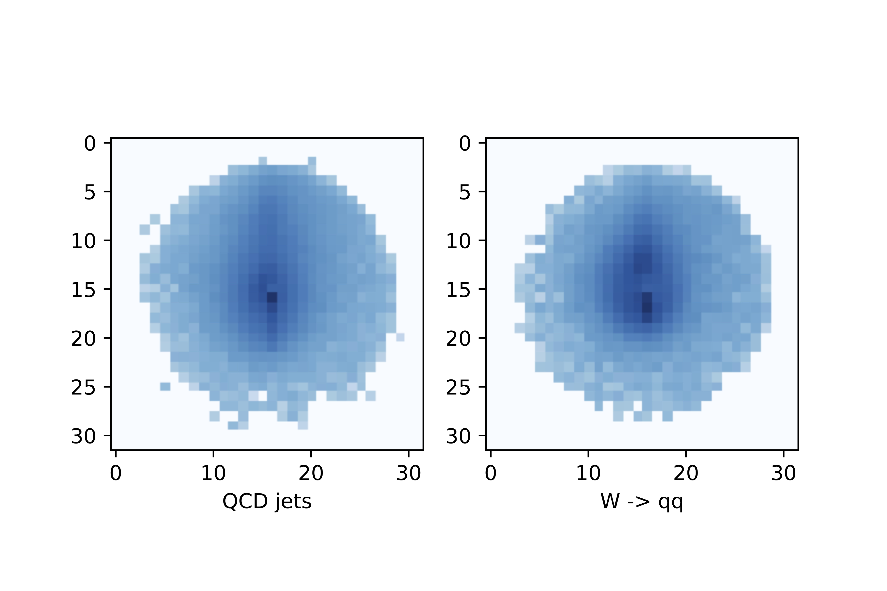
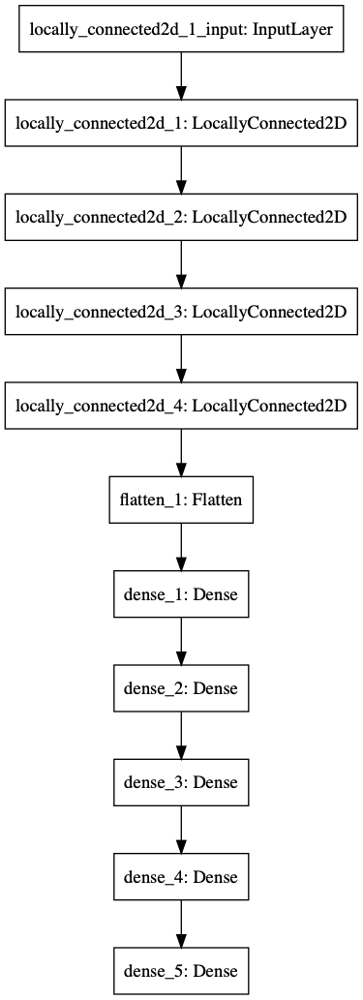
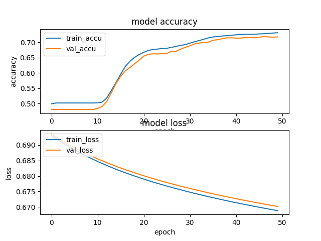
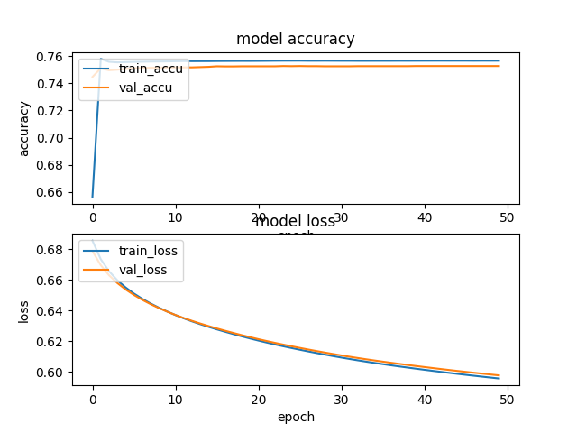
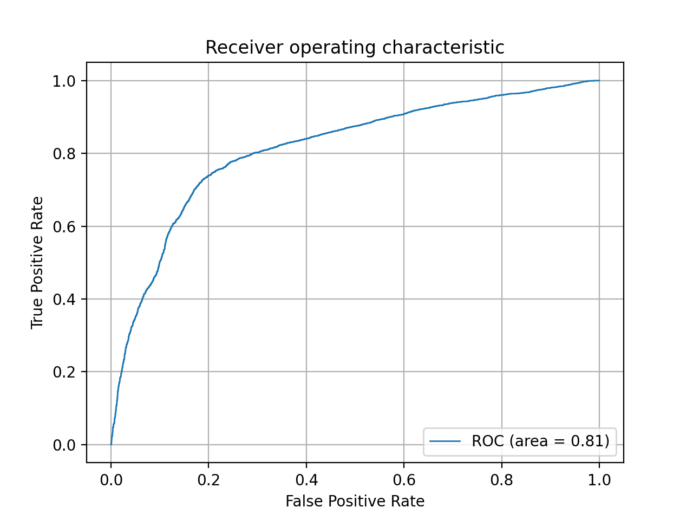

[toc]

# Summary

## W tagging 

Perform similar inference using BDT and NN as the [paper](https://arxiv.org/pdf/1603.09349v1.pdf).

## Goal 

Using high level vairables or jet images to distinguish W jets and QCD jets. 

## Methods

1. BDT
2. NN 

## Samples

Use the dataset from [UCI database](http://mlphysics.ics.uci.edu/data/hepjets/).

**Description:** The dataset is binary classification between a boosted dijet and a mono-jet. The files have 5 million events and the data labelled “high-level” is 6 jet substructure observables (i.e. jet-mass, N-subjettiness and 4 energy correlation variables). The dataset labelled “low-level” are jet-images, which are 32x32 matrices where an entry in the matrix is the pT in the calorimeter cell.

## Results

### BDT

use 100k samples to train and test, the classifications results and ROC:

### NN 

To begin with, I build a simple architecture with obly one hidden layer. Then I try to reproduce the results from the paper using the almost same configurations.

Average jet images with log scale: 

The images are centered, and rotated.  
We can learn from the plot there are 2 components in W signals while there is only one in QCD jets image.

#### A simple NN

Details: https://github.com/hrzhao76/W-tagging/blob/master/NN/NN-Keras-Theano-tutorial.ipynb

##### Configurations

| Configuration        | Values                                      |
| -------------------- | ------------------------------------------- |
| layer                | one hidden layer with 128 units             |
| activitaion function | Relu                                        |
| output               | linear output attached with a Softmax layer |

##### Results

Test loss: 0.31664343220392865
Test accuracy: 0.8730000257492065

##### Performance

##### Comments: 

This simple NN is overfitted. 

#### DNN

Details: https://github.com/hrzhao76/W-tagging/blob/master/NN/NN-Paper-tf.ipynb 
My code: https://github.com/hrzhao76/W-tagging/blob/master/NN/NN-Paper-tf.py

| Configuration       | Paper                                                        | Haoran                                                       |
| ------------------- | ------------------------------------------------------------ | ------------------------------------------------------------ |
| Hardware            | GPU NVidia Titan X                                           | CPU Intel i7 2.6 GHz                                         |
| Backend             | Theano                                                       | Tensorflow                                                   |
| Samples             | Training set:10 million validation set: 500kTest set: 5 million | Training set: 9000 validation set: 1000(val_Split = 10%)Test set: 10 k |
| Architecture (Same) | four locally-connected layers followed by four fully-connected layers of 425 units | four locally-connected layers followed by four fully-connected layers of 425 units |
| Neurons(Same)       | Activation: tanh Output unit: logistic                       | Activation: tanh Output unit: logistic                       |
| Optimizer(Same)     | ADAM Beta_1 = 0.9 Beta_2 = 0.999 Epsilon =1e-08 | ADAM Beta_1 = 0.9 Beta_2 = 0.999 Epsilon =1e-08 |
| Learning rate(Same) | 0.0001                                                       | 0.0001                                                       |
| Decay factor(Same)  | 0.9                                                          | 0.9                                                          |
| Batch_size(Same)    | 100                                                          | 100                                                          |
| Weights             | Initialized from a normal distribution                       | Initialized from a normal distributionmean=0.0 stddev=0.05   |
| Loss function       | Cross entropy                                                | binary_crossentropy                                          |
| Epochs (Same)       | 50                                                           | 50                                                           |
| Timing              |                                                              | ~ 6 hours                                                    |

##### Performance

note: validation samples are always 10% of the training samples.

my codes tested on 10k samples:
 

-> Should be more stat

However, 
my codes tested on 100k samples:

##### Comments:

Authors of the paper use 10 million samples to train the network and the AUC is **0.953** , However, mine is only 0.81.
Using the almost same parameters from the paper I cannot archieve the same performance as indicated in paper. The problems may:

1. training samples
2. the number of filters of locally connected layers(not indicated in paper)

